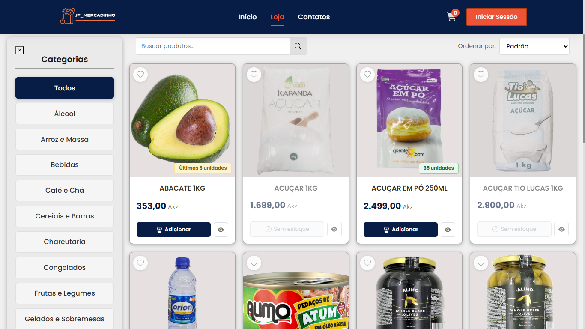
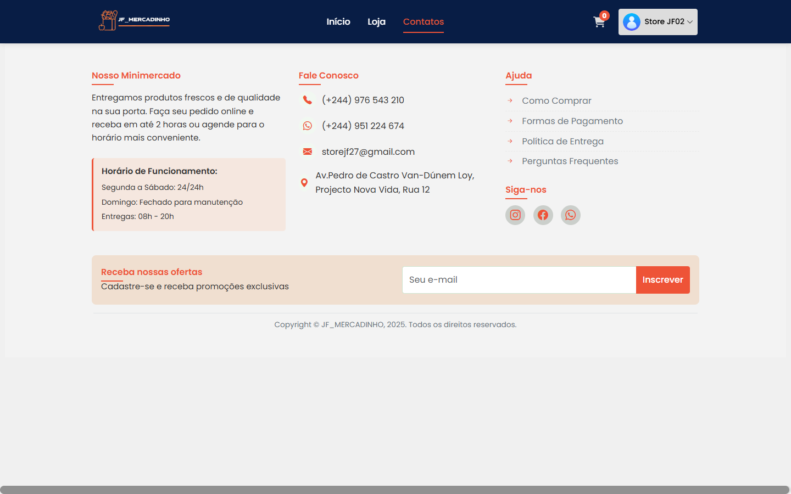
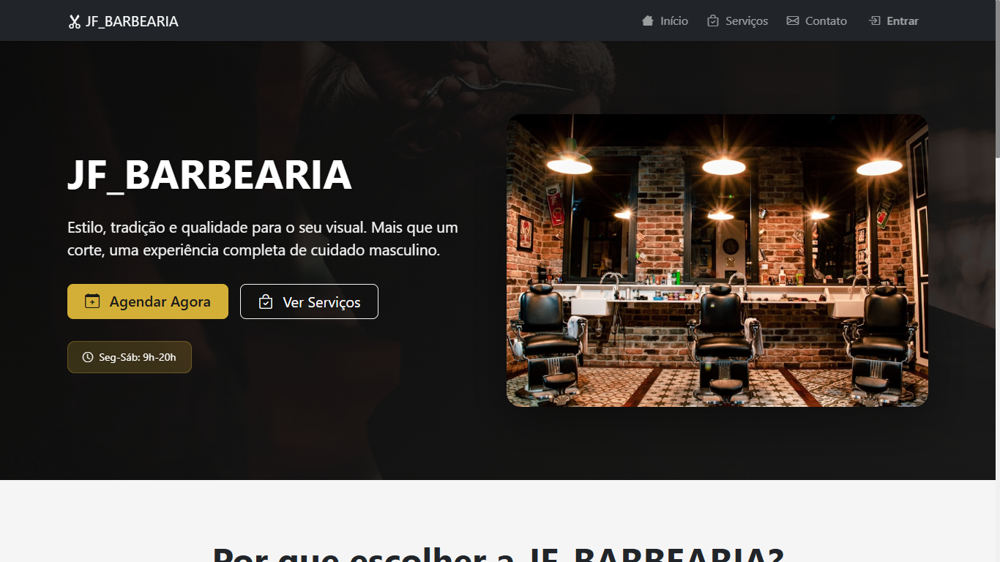
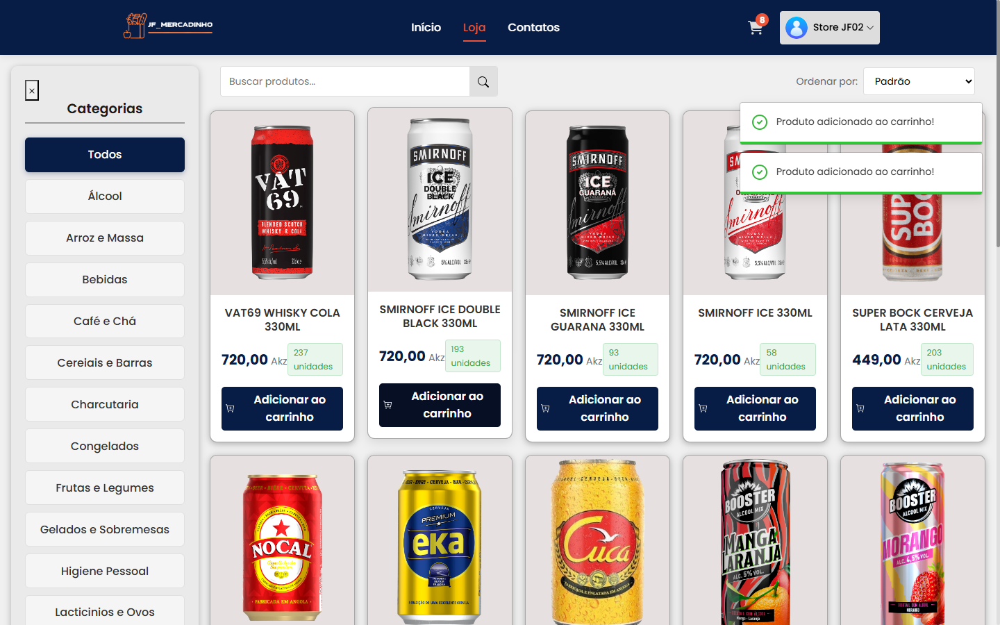
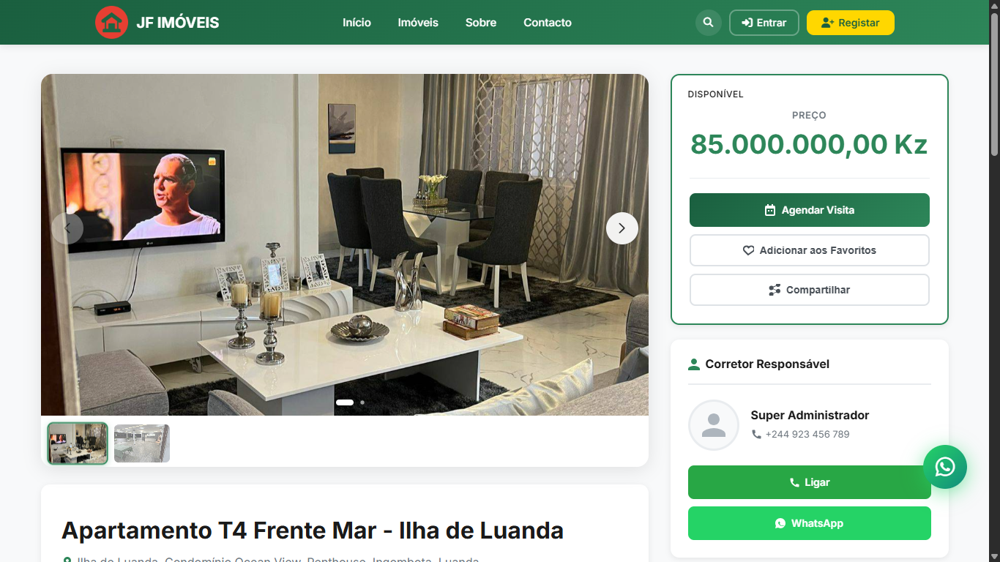

<!-- Header animado -->
<div align="center">
  
</div>

<br/>

<h1 align="center">JAIR FERNANDES DE CAMPOS</h1>

<p align="center">
  
  
  
</p>

<p align="center">
 
  <a href="https://github.com/JairFernandes23">
    
  </a>

</p>

---

### 🖥️ Projetos em Destaque

<div align="center">

| E-Commerce | Imobiliária | Barbearia |
|:---:|:---:|:---:|
| [](gallery/IMG_01.png) | [](gallery/IMG_03.png) | [](gallery/IMG_05.png) |
| **JF Mercadinho** | **JF Imobiliária** | **JF Barbearia** |

<!-- SECÇÃO COMENTADA
| Imobiliária | Barbearia | Portal |
|:---:|:---:|:---:|
| [](gallery/IMG_02.png) | [](gallery/IMG_04.png) | [](gallery/IMG_06.png) |
| **Imóveis Luanda** | **JF Barbearia** | **Portal Web** |
-->
> 🔍 *Clica em qualquer imagem para ver em tamanho completo*

</div>

---

### 👾 Sobre mim

```python
dev = {
    "nome":        "Jair Fernandes de Campos",
    "role":        "Full Stack Developer & Técnico de Informática",
    "localização": "Luanda, Angola 🇦🇴",
    "stack":       ["PHP", "HTML5", "CSS3", "Python", "MySQL"],
    "também":      ["Suporte técnico", "Redes LAN/Wi-Fi", "Manutenção de hardware"],
    "foco":        "Criar soluções web robustas e eficientes"
}
```

---

### 🛠️ Tech Stack

**Web & Programação**

<p align="left">
  
  
  
  
  
</p>

**Infraestrutura & Suporte**

<p align="left">
  
  
  
  
</p>

**Ferramentas**

<p align="left">
  
  
  
</p>

---

<p align="center">
  
</p>

<p align="center">
  <i>💻 Feito com dedicação por Jair Fernandes · Luanda, Angola 🇦🇴</i>
</p>
